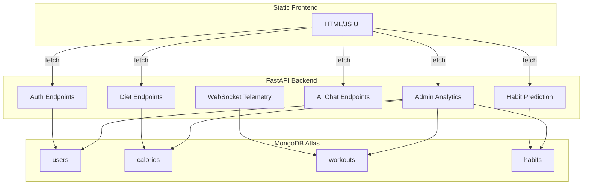

# AI Gym Fitness Assistant – Project Report

## Overview
The **AI Gym Fitness Assistant** is a full‑stack web application that helps users track workouts, monitor nutrition, and receive AI‑driven coaching. It consists of:

- **Frontend** – static HTML/JS (already completed) serving a responsive UI.
- **Backend** – FastAPI server (`server.py`) exposing REST endpoints for authentication, diet logging, habit prediction, AI chat, and admin analytics.
- **Database** – MongoDB Atlas (or in‑memory fallback) storing users, calorie logs, workout sessions, and habit predictions.
- **AI / ML** – optional scikit‑learn logistic regression model for habit‑risk prediction; falls back to a heuristic when the library is missing.
- **IoT Telemetry** – WebSocket endpoint simulating treadmill and dumbbell sensor data.

## Design Goals
- **Modularity** – each functional area (auth, diet, AI, IoT, admin) lives in its own route group.
- **Scalability** – stateless FastAPI service, easy to containerise and deploy to Render.
- **Extensibility** – plug‑in additional ML models or third‑party APIs without touching core logic.
- **Premium UI** – admin dashboard uses a dark‑theme, glass‑like cards, and smooth micro‑animations.

## Architecture Diagram

## Modules & Files
| File | Purpose |
|------|----------|
| `server.py` | FastAPI app, all routes, DB connection, AI logic |
| `admin.html` | Admin dashboard UI (served as static file) |
| `deployment.ps1` | PowerShell script for Render deployment |
| `docs/…` | Project documentation (report, installation, deployment, user manual, API) |
| `test_server.py` | Unit tests for key endpoints |

## Future Extensions
- Add OAuth2 authentication.
- Integrate real IoT devices via MQTT broker.
- Replace the heuristic model with a deep‑learning model hosted on an inference service.
- Implement role‑based access control for admin routes.
